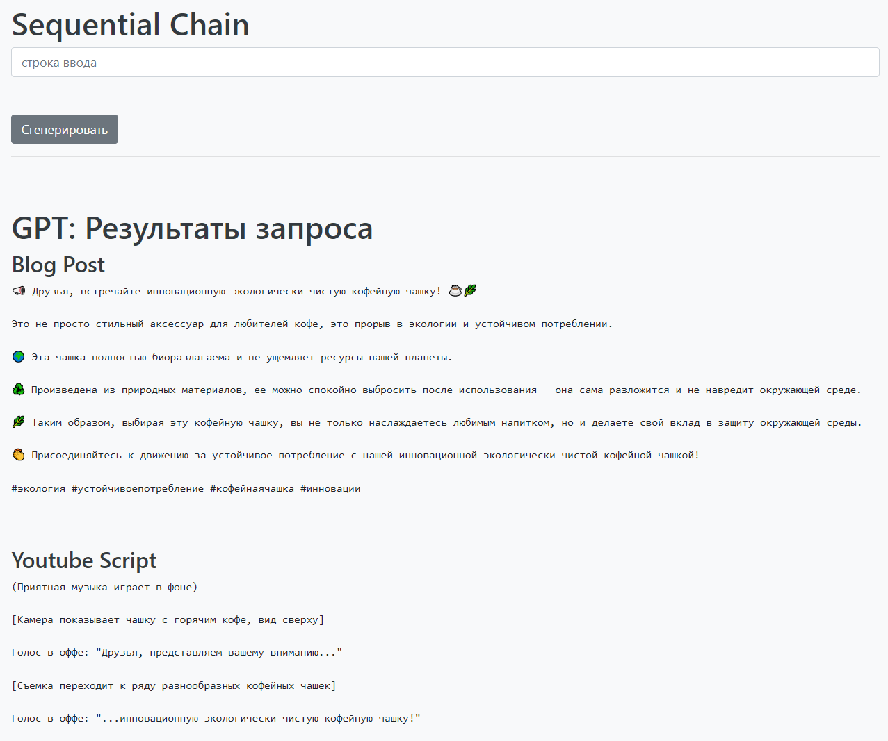
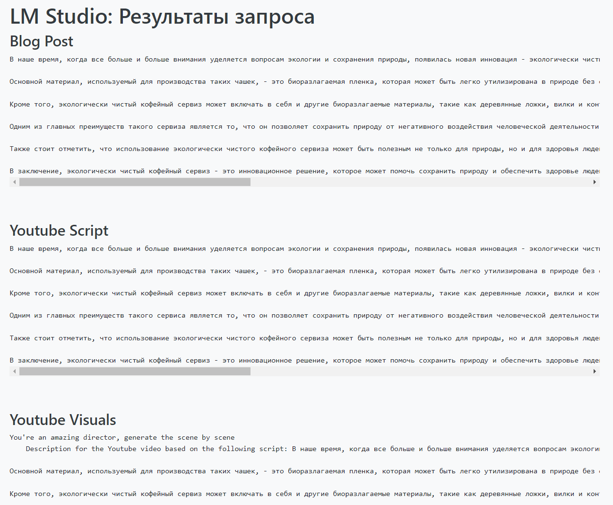
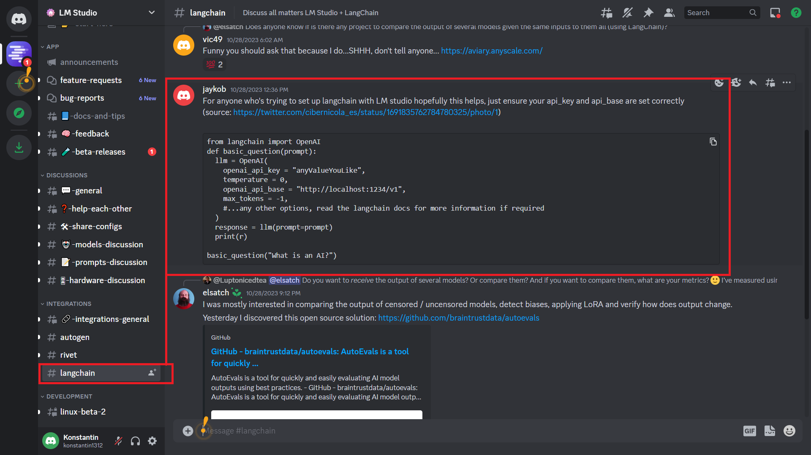
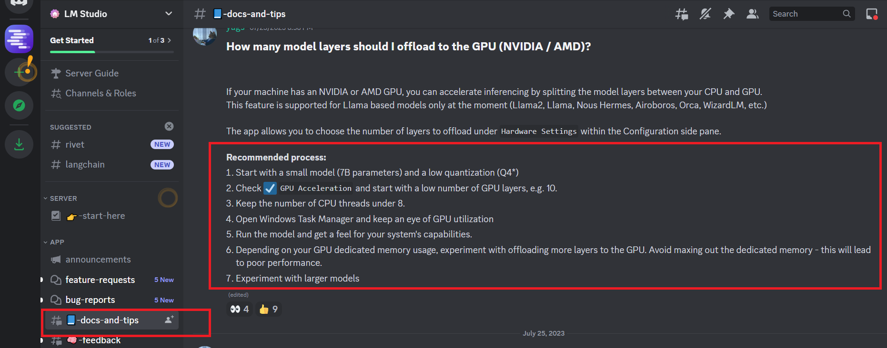

Приглашаю в Телеграм общаться по это теме: https://t.me/AiExp01
# LMChain_01
LM Studio: Sequential Chain

1. Работает ли под LM Studio Sequential Chain от LangChain?

2. Можно ли сравнить GPT и локальную модели используя Sequential Chain?

см. результат в файле Doc\SequentialChain.mhtml
 
или в файле Doc\output_01.txt
[output_01.txt](Doc%2Foutput_01.txt)

## LM Studio
В качестве сервера с LLM (Large language model) используется продукт LM Studio: https://lmstudio.ai/

### Скришот про интеграцию LM Studio

### Скришот про настройку LM Studio

### Скришот про размеры моделей и требуемые GPU

### Версия LM Studio под Linux
На текущий момент чтобы найти версию под Linux, нужно к ним на Discord зайти и дать согласие на beta, тогда в чате видна ветка linux-beta-2

Приглашаю в Телеграм общаться по это теме: https://t.me/AiExp01